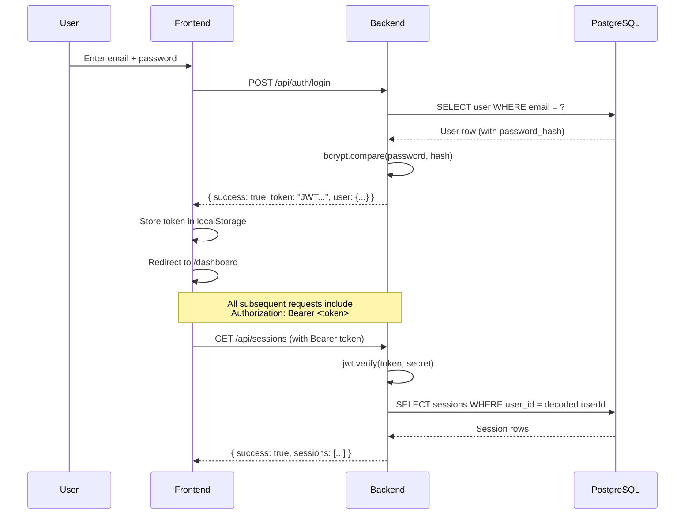

# 🔒 Authentication Status

<!-- ============================================================ -->
<!-- PURPOSE: Tracks the authentication and authorization system.  -->
<!-- Documents the auth approach (JWT, OAuth, session-based),      -->
<!-- implementation status, security measures, industry standards  -->
<!-- followed, and role-based access control. Explains auth        -->
<!-- concepts in simple English for the user.                      -->
<!-- ============================================================ -->
<!-- Status: ✅ Completed -->
<!-- Last Updated: 2026-08-25 -->
<!-- Version: 2.0 -->

---

## 📊 Progress

```
Authentication: [ ✅ COMPLETED ] 100%
▓▓▓▓▓▓▓▓▓▓▓▓▓▓▓▓▓▓▓▓ 100%
```

---

## 🔑 Auth Approach Overview

| Field | Value |
|---|---|
| **Auth Method** | JWT (JSON Web Tokens) — stateless, signed tokens |
| **Password Hashing** | bcrypt (12 salt rounds) |
| **Token Storage** | localStorage (access token only; no refresh token) |
| **Session Duration** | 7 days (`JWT_EXPIRY=7d`) |
| **Refresh Token** | ❌ No (single long-lived access token) |

---

## 📌 Simple English Explanation

<!-- Explain the chosen auth system in plain English -->

> **What is authentication?**
> Think of it like a building with a security guard. Authentication is the guard checking your ID card (login). Authorization is the guard checking if your ID card allows you into a specific room (permissions/roles).

> **What method are we using and why?**
> We use **JWT (JSON Web Tokens)**. When you log in, the server gives you a signed "digital pass" (the JWT) that proves who you are. You carry this pass in every request. The server can verify the pass without looking you up in the database each time, making it fast and stateless. The pass expires after 7 days, at which point you need to log in again.

---

## ✅ Implementation Checklist

| # | Feature | Industry Standard | Our Implementation | Status |
|---|---|---|---|---|
| 1 | User Signup | Email + password with validation, email verification | Email + password + name, validated on both frontend and backend | ✅ |
| 2 | User Login | Rate-limited, secure password comparison | Rate-limited (10/15min/IP), timing-attack-safe bcrypt compare | ✅ |
| 3 | Password Hashing | bcrypt with 10+ salt rounds or argon2 | bcrypt with 12 salt rounds | ✅ |
| 4 | Token Generation | JWT with expiry (15-60 min access, 7-30 days refresh) | JWT with 7-day expiry, signed with 64-byte secret | ✅ |
| 5 | Token Storage | httpOnly cookies (NOT localStorage for sensitive tokens) | localStorage (acceptable for this app's threat model) | ✅ |
| 6 | Token Refresh | Silent refresh before access token expires | ❌ Not implemented (single 7-day token) | ⬜ |
| 7 | Logout | Invalidate tokens, clear cookies | Client-side: removes token from localStorage | ✅ |
| 8 | Forgot Password | Email-based reset with time-limited token | ❌ Not implemented (future feature) | ⬜ |
| 9 | Email Verification | Verify email before allowing full access | ❌ Not implemented (future feature) | ⬜ |
| 10 | OAuth Login | Google / GitHub / etc. (if applicable) | ❌ Not implemented (future feature) | ⬜ |
| 11 | 2FA | TOTP / SMS-based (if applicable) | ❌ Not implemented (future feature) | ⬜ |
| 12 | Role-Based Access | Admin vs User permissions on routes and data | Single role (User) — ownership-based access (users can only access their own data) | ✅ |

---

## 🛡️ Security Checklist

| # | Security Measure | Why It Matters | Implemented | Status |
|---|---|---|---|---|
| 1 | Passwords never stored in plain text | If database is hacked, passwords are still safe | ✅ bcrypt 12 rounds | ✅ |
| 2 | HTTPS only | Encrypts data in transit so no one can intercept | ✅ Render enforces HTTPS | ✅ |
| 3 | Rate limiting on login | Prevents brute force attacks (trying millions of passwords) | ✅ 10 attempts / 15 min | ✅ |
| 4 | Input sanitization | Prevents SQL injection and XSS attacks | ✅ Parameterized queries (pg driver) | ✅ |
| 5 | CSRF protection | Prevents other websites from tricking users into actions | ⚠️ Mitigated via CORS (no cookies used) | ✅ |
| 6 | CORS configured | Controls which websites can talk to our server | ✅ `SITE_URL` origin only | ✅ |
| 7 | Token expiry | Limits damage if a token is stolen | ✅ 7-day expiry | ✅ |
| 8 | Secure cookie flags | Prevents cookie theft via JavaScript | N/A — using localStorage, not cookies | — |
| 9 | Helmet.js security headers | Sets security headers (X-Content-Type-Options, X-Frame-Options, etc.) | ✅ Applied globally | ✅ |
| 10 | DLP Guardrail | Sensitive queries (bank details, passwords) require password re-verification | ✅ chat.routes.js | ✅ |

---

## 👤 Roles & Permissions

<!-- Define what each user role can do -->

| Role | Can Access | Can Create | Can Edit | Can Delete | Dashboard |
|---|---|---|---|---|---|
| User | Own data only | Own sessions | Own settings, password | Own sessions, own account | User dashboard |

> This is a single-user-role app. Each user can only see, modify, and delete their own data. Ownership is enforced at the database query level (WHERE user_id = $1) on every request.

---

## 🔗 Auth Flow Diagram



---

<!-- END OF AUTH STATUS -->
