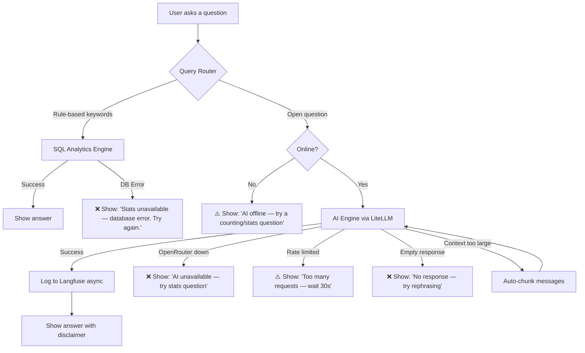
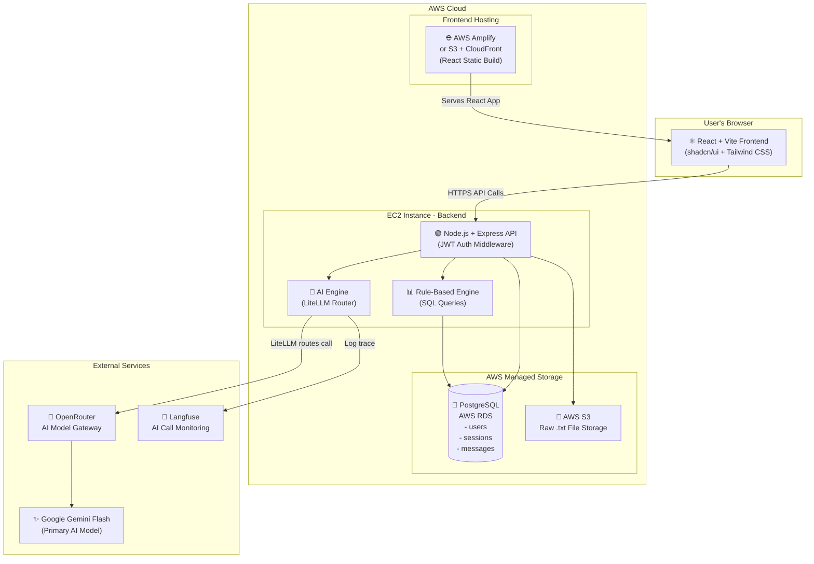
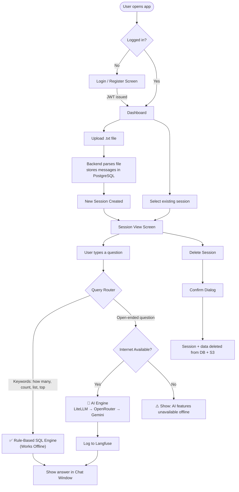

# 📐 Project Blueprint

<!-- ============================================================ -->
<!-- PURPOSE: The locked-in project plan. This is our "contract". -->
<!-- Contains: project vision, target users, platform, features,  -->
<!-- screens, components, architecture decisions, and scope.      -->
<!-- Nothing gets built until this is reviewed and approved.      -->
<!-- ============================================================ -->
<!-- Status: 🟡 DRAFT — Awaiting User Approval -->
<!-- Last Updated: 2026-08-18 -->
<!-- Version: 1.0 -->

---

## 📊 Overall Progress

```
Blueprint Status: [ ✅ APPROVED & LOCKED ]
▓▓▓▓▓▓▓▓▓▓▓▓▓▓▓▓▓▓▓▓ 100%
```

---

## 🎯 Project Vision

**WhatsApp Chat Analyzer** is a private, web-based AI-powered tool that lets a small group of trusted users upload their exported WhatsApp `.txt` chat files and gain deep insights from their conversations. The app combines a **Rule-Based Analytics Engine** (using SQL for deterministic, fast stats like message counts, word frequency, and activity timelines) with an **AI-Powered Q&A Engine** (using Google Gemini via OpenRouter + LiteLLM for summaries, sentiment analysis, and contextual natural language questions). The AI layer is fully observable via Langfuse. Users can manage multiple analysis sessions and delete their data at any time. Deployed entirely on AWS Cloud.

---

## 👥 Target Users

| Role | Description | Key Needs |
|---|---|---|
| **Registered User** | A trusted individual (max ~5–10 people) with their own private account | Upload chats, ask questions, view analytics, manage their own sessions |

> 🔒 **Privacy Model:** Each user can ONLY see their own uploaded chats and analysis sessions. No shared workspaces. No user can view another user's data.

---

## 📱 Platform

| Platform | Included? | Notes |
|---|---|---|
| Website (Desktop) | ✅ Yes | Primary experience |
| Website (Mobile Responsive) | ✅ Yes | Must work on mobile browser too |
| Android App | ❌ No | Out of scope |
| iOS App | ❌ No | Out of scope |
| Windows Desktop App | ❌ No | Out of scope |

---

## 📐 Scale & Budget Analysis

| Metric | Value |
|---|---|
| Expected users (launch) | ~5 users |
| Expected users (1 year) | ~10 users max |
| Scalability requirement | None — personal project |
| AWS Free Tier period | 12 months |
| Estimated cost during free tier | ~$2–5/month (OpenRouter AI usage only) |
| Estimated cost after free tier | ~$25–40/month (EC2 + RDS + AI usage) |
| Break-even point | N/A — personal project, no revenue |

---

## 🧩 Features List

### ✅ Must Have (Core Features)

| # | Feature | Description | Screens Involved | Status |
|---|---|---|---|---|
| 1 | **JWT Authentication** | Register, Login, Logout. Secure API routes with JWT tokens. bcrypt password hashing. | Login/Register | ⬜ |
| 2 | **WhatsApp File Upload & Parsing** | Upload `.txt` WhatsApp exports (up to 15MB). Parse into structured messages in PostgreSQL. Show parsing progress bar. | Dashboard | ⬜ |
| 3 | **Session Management** | Each uploaded chat = one Analysis Session. Users can have multiple sessions. View, switch, delete sessions. | Dashboard, Sidebar | ⬜ |
| 4 | **Chat Interface (AI Q&A)** | Modern chat UI. User types a natural language question. Backend routes to rule-based engine or AI engine automatically. | Session View | ⬜ |
| 5 | **Rule-Based Analytics Engine** | Fast SQL-powered stats: message counts, most active user, activity timeline, word frequency, peak hours, emoji stats, response time, media counts, link counts, longest message. Works offline. | Analytics Panel | ⬜ |
| 6 | **AI-Powered Engine (Gemini via OpenRouter + LiteLLM)** | Summaries, sentiment analysis, topic detection, contextual Q&A, memory search, mood tracking. Requires internet. | Session View (Chat) | ⬜ |
| 7 | **AI Observability (Langfuse)** | Every AI call is logged — prompt, response, cost, latency. Used by developer for debugging. | External Langfuse Dashboard | ⬜ |
| 8 | **Data Deletion** | Users can delete individual sessions (data + raw file) or their entire account. Confirmation dialogs required. | Settings, Session View | ⬜ |
| 9 | **In-App Guide System (ℹ️)** | Every major section has an ℹ️ button. Opens tooltip/modal explaining the feature, what questions to ask, and gives example prompts. | All Screens | ⬜ |
| 10 | **Offline Indicator + Degraded Mode** | When offline: AI features are visually grayed out with a clear message. Rule-based analytics still work normally. | Session View | ⬜ |

### 🔵 Nice to Have (Post-Core)

| # | Feature | Description | Priority | Status |
|---|---|---|---|---|
| 1 | **Activity Timeline Chart** | Line/bar chart showing messages over time (using Recharts) | High | ⬜ |
| 2 | **Word Cloud Visualization** | Visual word cloud from the word frequency data | Medium | ⬜ |
| 3 | **AI Model Switcher** | UI dropdown in Settings to switch AI model (e.g., Gemini Flash → GPT-4o Mini) | Medium | ⬜ |
| 4 | **Chat Search** | Search raw messages within a session by keyword | Medium | ⬜ |
| 5 | **Export Analytics** | Download a PDF/CSV report of session analytics | Low | ⬜ |
| 6 | **Conversation Comparison** | Compare two different sessions side-by-side | Low | ⬜ |

---

## 🖥️ Screens List

| # | Screen Name | Purpose | Key Features on This Screen | Status |
|---|---|---|---|---|
| 1 | **Login / Register** | User authentication entry point | Login form, Register form, JWT token handling | ⬜ |
| 2 | **Dashboard (Home)** | Central hub after login | Upload new `.txt` file, list of all sessions, delete session, start new analysis | ⬜ |
| 3 | **Session View** | Main working screen for one analysis session | Chat UI, Analytics Panel, Session Sidebar, ℹ️ Guide buttons, Offline indicator | ⬜ |
| 4 | **Analytics Panel** | Sub-section within Session View | All rule-based stats: counts, word freq, timelines, emoji stats, charts | ⬜ |
| 5 | **Settings** | User account management | Change password, Delete account + all data, AI Model Switcher (post-core) | ⬜ |
| 6 | **Guide / Help Modal** | Contextual in-app guide | Triggered by ℹ️ button. Shows capabilities, example questions, tips per feature | ⬜ |

---

## 🧱 Components List

| # | Component | Used In (Screens) | Description | Status |
|---|---|---|---|---|
| 1 | **Navbar / Topbar** | All screens | Logo, user avatar, logout, settings link | ⬜ |
| 2 | **Session Sidebar** | Dashboard, Session View | Collapsible list of all user's sessions with delete option | ⬜ |
| 3 | **FileUploadBox** | Dashboard | Drag-and-drop / click-to-upload box for `.txt` files. Shows file size + progress bar. | ⬜ |
| 4 | **ChatWindow** | Session View | Scrollable message feed. Shows user questions and AI/rule-based answers with badges. | ⬜ |
| 5 | **ChatInputBar** | Session View | Text input + submit button. Greyed out for AI questions when offline. | ⬜ |
| 6 | **AnalyticsCard** | Analytics Panel | Reusable card for displaying a single stat (e.g., "Total Messages: 4,521") | ⬜ |
| 7 | **ChartComponent** | Analytics Panel | Line/bar chart for activity over time (Recharts library) | ⬜ |
| 8 | **GuideTooltip / GuideModal** | All Screens | The ℹ️ tooltip or modal with feature explanations and example questions | ⬜ |
| 9 | **OfflineBanner** | Session View | Subtle banner: "AI features unavailable — offline mode" | ⬜ |
| 10 | **ConfirmDialog** | Dashboard, Settings | "Are you sure?" modal before any deletion action | ⬜ |
| 11 | **LoadingSpinner / SkeletonCard** | All Screens | Used during file parsing, AI response loading, etc. | ⬜ |
| 12 | **AuthForm** | Login/Register | Login and registration form with client-side validation | ⬜ |

---

## 🏗️ Architecture Decision

**Architecture Type:** Monolith (Single Backend API) — correct for our scale.

**Query Routing Logic:**
- Questions containing keywords like "how many", "most", "count", "when", "list", "top" → **Rule-Based SQL Engine** (instant, offline-capable)
- All other open-ended questions → **AI Engine** (Gemini via OpenRouter + LiteLLM)
- User can manually toggle which engine to use for any question

---

## 📊 Rule-Based Analytics — Full Capability List

| Stat | Works Offline? |
|---|---|
| Total message count | ✅ Yes |
| Messages per person (breakdown) | ✅ Yes |
| Most active user | ✅ Yes |
| Messages per day / week / month | ✅ Yes |
| Peak hour of activity | ✅ Yes |
| Top N words (word frequency) | ✅ Yes |
| Emoji frequency stats | ✅ Yes |
| Media message count | ✅ Yes |
| Link/URL count | ✅ Yes |
| Longest single message | ✅ Yes |
| Average response time per person | ✅ Yes |

---

## 🤖 AI Engine Capabilities (Requires Internet)

| Feature | Description |
|---|---|
| Chat Summary | "Give me a summary of this conversation" |
| Sentiment Analysis | Overall tone, per-person positivity/negativity |
| Topic Detection | "What are the main topics discussed?" |
| Contextual Q&A | "When did we plan the Goa trip?" / "What did John say about the deadline?" |
| Memory Search | "Find all messages about money" |
| Mood Timeline | How did the emotional tone change over time? |

---

## 🛡️ Error Handling, Fallbacks & Edge Cases

> This section defines exactly what happens when something goes wrong at every layer of the app.
> Every error must: (1) show the user a clear human-readable message, (2) log the technical detail server-side, and (3) not crash the app.

---

### 📁 Layer 1: File Upload Errors

| Error / Edge Case | What Causes It | What User Sees | What System Does |
|---|---|---|---|
| **Wrong file type** | User uploads a `.pdf`, `.zip`, or image instead of `.txt` | ❌ "Only WhatsApp `.txt` export files are accepted. Please export your chat from WhatsApp and try again." | Frontend rejects before upload. No server call made. |
| **File too large (>15MB)** | Extremely long chat history | ❌ "This file is too large (X MB). Maximum size is 15MB. Try exporting a shorter chat period." | Frontend size check before upload. Block upload. |
| **Empty file (0 bytes)** | User accidentally uploads a blank file | ❌ "This file appears to be empty. Please check your WhatsApp export and try again." | Backend checks file size after receiving. Rejects immediately. |
| **Network failure during upload** | Internet drops mid-upload | ❌ "Upload failed due to a connection issue. Your file was not saved — please try again." | Frontend detects failed request. Shows retry button. File NOT partially saved. |
| **S3 storage failure** | AWS S3 is unreachable | ❌ "File could not be saved at this time. Please try again in a few minutes." | Backend catches S3 error. Does NOT proceed to parsing. Logs error server-side. |
| **Duplicate file upload** | User uploads the same chat file twice | ⚠️ "A session with this file already exists. Do you want to create a new session anyway?" | Detect by file name + size hash. Give user choice. |

---

### ⚙️ Layer 2: Parsing Errors (WhatsApp `.txt` → Database)

WhatsApp exports can be messy. Android and iOS use slightly different formats, and formats differ by region and language.

| Error / Edge Case | What Causes It | What User Sees | What System Does |
|---|---|---|---|
| **Unrecognized format / not a WhatsApp export** | User uploads a random `.txt` file that isn't a WhatsApp export | ❌ "This doesn't look like a WhatsApp chat export. Please use the 'Export Chat' option in WhatsApp and upload the `.txt` file." | Parser detects if 0 messages were found in the expected format. Deletes uploaded S3 file. |
| **Partial parse failure** | Some lines have unusual characters / emojis that break the parser | ⚠️ "Chat parsed successfully! Note: X messages could not be read and were skipped." | Parser uses try/catch per line. Skips bad lines and counts them. Session is still created with what was parsed. |
| **iOS vs Android format mismatch** | WhatsApp iOS uses `[DD/MM/YYYY, HH:MM:SS]` and Android uses `DD/MM/YYYY, HH:MM -` | Handled silently | Parser detects format automatically using regex pattern matching on first 10 lines. Falls back to secondary pattern if first fails. |
| **Non-English date formats** | Some regions use different date separators or 12hr/24hr time | Handled silently | Parser tries multiple known date format patterns (ISO, US, European). If all fail → shows partial parse warning. |
| **Media-only chat (no text)** | A chat where people only sent images/videos, no text | ⚠️ "This chat has very few text messages — most content was media. Analytics will show media counts but Q&A will be limited." | Session is created. Stats show media count. AI is warned in system prompt about limited text context. |
| **Parser timeout (>30 seconds)** | Extremely large file (near 15MB) on a slow server | ❌ "Parsing is taking too long. Please try again or use a shorter chat export." | Backend sets a 30-second timeout on the parser process. Cleans up partial DB records and S3 file on timeout. |
| **Database insertion failure during parse** | RDS is unreachable or disk full mid-parse | ❌ "Your chat was uploaded but could not be saved. Please try again." | Wrap entire parse+insert in a database transaction. On failure → ROLLBACK all inserted messages. Delete S3 file. No partial sessions left behind. |

---

### 🗄️ Layer 3: Database (PostgreSQL / RDS) Errors

| Error / Edge Case | What Causes It | What User Sees | What System Does |
|---|---|---|---|
| **RDS connection failure** | AWS RDS instance is down or unreachable | ❌ "We're having trouble connecting to the database. Please try again in a moment." | Backend middleware catches DB connection errors. Returns `503 Service Unavailable`. App shows a full-page error state, not a broken UI. |
| **Query timeout** | A complex analytics query takes too long | ❌ "This query took too long to complete. Try narrowing your question (e.g., a specific date range)." | Set a 10-second timeout on all DB queries. Return a user-friendly timeout message. |
| **SQL injection attempt** | Malicious input in the question box | Handled silently | All user inputs go through parameterized queries (`$1, $2` placeholders). Never string-concatenated into SQL. ORM (Prisma) enforces this automatically. |
| **Session not found** | User accesses a deleted or invalid session URL | ❌ "This session no longer exists. It may have been deleted." | Backend returns `404`. Frontend redirects to Dashboard with the error message shown. |

---

### 🤖 Layer 4: AI Engine Errors (LiteLLM / OpenRouter / Gemini)

| Error / Edge Case | What Causes It | What User Sees | What System Does |
|---|---|---|---|
| **OpenRouter API is down** | External service outage | ❌ "AI is temporarily unavailable. Your rule-based analytics still work — try asking a counting or stats question instead." | Backend catches HTTP error from OpenRouter. Does NOT crash. Suggests rule-based alternative. Logs to Langfuse (if reachable) or to server log. |
| **Rate limit exceeded** | Too many API calls in a short time (unlikely at our scale) | ⚠️ "You've sent too many questions too quickly. Please wait a moment and try again." | Backend catches 429 Too Many Requests. Shows cooldown message with a timer. |
| **Context window too large** | User asks AI about a 50,000-message chat and we try to send all of it | Handled silently | Backend implements **message chunking**: sends only the most recent or most relevant N messages (configurable, e.g., last 500 messages). For summaries, summarizes in batches of 500 and combines. |
| **AI returns empty response** | Model sometimes returns nothing | ❌ "The AI didn't return a response. Please try rephrasing your question." | Backend checks if response body is empty/null. Returns a clean error, not a crash. |
| **AI returns a hallucinated date/name** | AI confidently says something wrong | Shown as-is with a disclaimer | Every AI response includes a footer: ⚠️ "AI answers may not be 100% accurate. Verify important details in the original chat." |
| **Langfuse logging failure** | Langfuse server is unreachable | Handled silently — user is never affected | Langfuse logging is always done asynchronously (non-blocking). If it fails, it logs locally to server file. The user's AI answer is NOT delayed. |
| **AI model switch (LiteLLM)** | User switches model in Settings and the new model is incompatible | ❌ "The selected model is currently unavailable via OpenRouter. Switching back to Gemini Flash." | LiteLLM Proxy catches the routing error. Backend falls back to the default model (`gemini/gemini-flash`) automatically. |

---

### 🔐 Layer 5: Authentication Errors

| Error / Edge Case | What Causes It | What User Sees | What System Does |
|---|---|---|---|
| **Wrong password** | User types incorrect password | ❌ "Incorrect email or password." (deliberately vague — don't tell them which is wrong) | Backend returns generic 401. Never reveals if the email exists. |
| **Too many failed login attempts** | Brute-force attack | ❌ "Too many failed attempts. Please wait 15 minutes before trying again." | Rate limiter (`express-rate-limit`) locks the IP after 5 failed attempts for 15 minutes. |
| **JWT token expired** | User's session is older than 7 days (configurable) | ❌ "Your session has expired. Please log in again." | Frontend detects 401 response. Clears stored token. Redirects to Login page. |
| **JWT token tampered** | Someone modifies the token | ❌ "Invalid session. Please log in again." | JWT signature verification fails. Returns 401. |
| **Register with existing email** | Email already in use | ❌ "An account with this email already exists. Try logging in instead." | Backend returns 409 Conflict. |

---

### 🌐 Layer 6: Network / Offline Edge Cases

| Error / Edge Case | What Causes It | What User Sees | What System Does |
|---|---|---|---|
| **User goes offline mid-session** | Internet drops while they're in Session View | ⚠️ Orange banner appears: "You're offline. AI questions are paused. Stats and analytics still work." | Frontend uses `navigator.onLine` + `window` event listeners to detect online/offline state in real time. |
| **User comes back online** | Internet reconnects | ✅ Banner changes to: "You're back online! AI features are available again." | Banner auto-dismisses after 3 seconds. AI input box becomes active again. |
| **API request timeout (non-DB)** | Server is slow or overloaded | ❌ "The request took too long. Please try again." | All API calls have a 30-second timeout on the frontend (via Axios/fetch `timeout` config). |
| **User submits question while AI is already processing** | Clicks send before previous answer arrives | Handled silently | Submit button is disabled while a request is in flight. Shows a loading spinner in the chat input. |

---

### 🗑️ Layer 7: Data Deletion Edge Cases

| Error / Edge Case | What Causes It | What User Sees | What System Does |
|---|---|---|---|
| **S3 file deletion fails during session delete** | AWS S3 unreachable at the moment of deletion | ⚠️ "Session data was removed, but the original file could not be deleted from storage. We'll retry automatically." | DB records are deleted (source of truth). S3 deletion is queued for retry. A background cleanup job re-attempts S3 deletion for orphaned files daily. |
| **User deletes account mid-session** | Deletes account from Settings while Session View is open | Handled gracefully | On account deletion: JWT invalidated immediately, all DB records cascade-deleted (via `ON DELETE CASCADE`), all S3 files deleted. User redirected to login with message: "Your account and all data have been deleted." |
| **Double-click on delete button** | User clicks delete twice quickly | Handled silently | Delete button is disabled immediately on first click. DB deletion is idempotent (deleting a non-existent record is not an error). |

---

### 📋 Layer 8: General Frontend Edge Cases

| Error / Edge Case | What Causes It | What User Sees | What System Does |
|---|---|---|---|
| **Very long AI response** | AI writes a 3,000-word essay | Handled gracefully | Chat window renders long text with a "Show more / Show less" toggle after 500 characters. |
| **Session with 0 messages parsed** | Parsing succeeded but found nothing | ⚠️ "No messages were found in this file. The session was created but has no data to analyze." | Session is created but marked as `empty`. User can delete it. Analytics panel shows zeros. |
| **User types in a non-English language** | Hindi, Tamil, etc. question typed | Handled transparently | AI engine receives the question as-is. Gemini supports multilingual input. Rule-based routing still works on English keywords; falls back to AI for others. |
| **Concurrent upload** | User uploads two files at the same time | ❌ "Please wait for the current upload to finish before uploading another file." | Frontend disables the upload button while an upload is in progress. |

---

### 🔄 Fallback Strategy Summary



---

## 🗺️ System Architecture Diagram



---

## 🔄 User Journey Flow



---

## 🚫 Out of Scope

| # | Item | Reason |
|---|---|---|
| 1 | Mobile App (Android/iOS) | Web-responsive is sufficient |
| 2 | WhatsApp media file content | Media not in `.txt` exports; we only count references |
| 3 | Shared / collaborative workspaces | Each user's data is strictly private |
| 4 | Email notifications | Not needed for personal tool |
| 5 | Payment / subscription system | Free personal project |
| 6 | Real-time user-to-user chat | Not in scope; solo analysis tool |
| 7 | WhatsApp direct API / live integration | We only parse exported `.txt` files |

---

## ✅ Approval

| Item | Status |
|---|---|
| User reviewed | ✅ Yes |
| User approved | ✅ Yes |
| Approved date | 2026-08-18 |
| Version | 1.0 — Locked |

---

<!-- END OF BLUEPRINT -->
