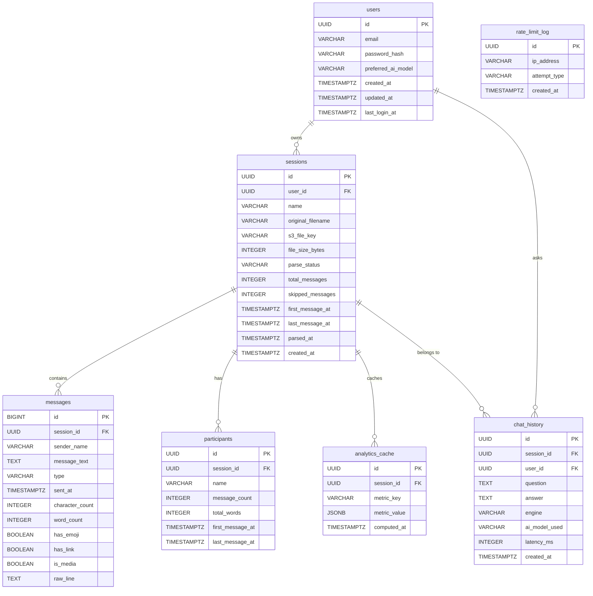

# 🗄️ Database Schema

<!-- ============================================================ -->
<!-- PURPOSE: Visual representation of the database schema.       -->
<!-- Shows all tables, their fields, data types, relationships,   -->
<!-- foreign keys, indexes, and SQL. Updated whenever schema      -->
<!-- changes. Uses Mermaid ER diagrams for visual clarity.        -->
<!-- ============================================================ -->
<!-- Status: ✅ Defined — Awaiting Implementation -->
<!-- Last Updated: 2026-08-18 -->
<!-- Version: 1.0 -->

---

## 📊 Progress

```
Schema Defined:    [ ✅ COMPLETE ]  ▓▓▓▓▓▓▓▓▓▓▓▓▓▓▓▓▓▓▓▓ 100%
Migration Run:     [ ⬜ PENDING  ]  ░░░░░░░░░░░░░░░░░░░░   0%
Seeded (test data):[ ⬜ PENDING  ]  ░░░░░░░░░░░░░░░░░░░░   0%
```

---

## 🧩 Tables Overview

| Table | Purpose | Row Estimate |
|---|---|---|
| `users` | Registered user accounts | ~10 rows |
| `sessions` | Each uploaded WhatsApp chat = one session | ~50 rows (5 users × 10 sessions) |
| `messages` | Every parsed message from a WhatsApp chat | ~500,000 rows (large chats) |
| `participants` | Unique senders discovered in a chat | ~200 rows |
| `analytics_cache` | Pre-computed stats to avoid repeated heavy queries | ~500 rows |
| `chat_history` | User's Q&A conversation history within the app | ~10,000 rows |
| `rate_limit_log` | Tracks failed login attempts for brute-force protection | ~200 rows |

---

## 🔗 Relationships Diagram (ERD)



---

## 📋 Table Definitions (Full Detail)

---

### 🔹 Table: `users`

> Stores all registered user accounts.

| Column | Type | Constraints | Description |
|---|---|---|---|
| `id` | `UUID` | PRIMARY KEY, DEFAULT gen_random_uuid() | Unique user ID |
| `email` | `VARCHAR(255)` | NOT NULL, UNIQUE | Login email address |
| `password_hash` | `VARCHAR(255)` | NOT NULL | bcrypt-hashed password. NEVER plain text. |
| `preferred_ai_model` | `VARCHAR(100)` | DEFAULT 'gemini/gemini-flash' | The AI model the user prefers (model switcher feature) |
| `created_at` | `TIMESTAMPTZ` | NOT NULL, DEFAULT NOW() | When account was registered |
| `updated_at` | `TIMESTAMPTZ` | NOT NULL, DEFAULT NOW() | Last profile update |
| `last_login_at` | `TIMESTAMPTZ` | NULLABLE | Tracks last login time |

```sql
CREATE TABLE users (
    id UUID PRIMARY KEY DEFAULT gen_random_uuid(),
    email VARCHAR(255) NOT NULL UNIQUE,
    password_hash VARCHAR(255) NOT NULL,
    preferred_ai_model VARCHAR(100) NOT NULL DEFAULT 'gemini/gemini-flash',
    created_at TIMESTAMPTZ NOT NULL DEFAULT NOW(),
    updated_at TIMESTAMPTZ NOT NULL DEFAULT NOW(),
    last_login_at TIMESTAMPTZ
);
```

---

### 🔹 Table: `sessions`

> Each uploaded WhatsApp `.txt` file creates one session. Everything else hangs from this.

| Column | Type | Constraints | Description |
|---|---|---|---|
| `id` | `UUID` | PRIMARY KEY | Unique session ID |
| `user_id` | `UUID` | NOT NULL, FK → users.id CASCADE | Owner of this session |
| `name` | `VARCHAR(255)` | NOT NULL | Display name (e.g., "Chat with Mom"). User can rename. |
| `original_filename` | `VARCHAR(500)` | NOT NULL | The original `.txt` filename uploaded |
| `s3_file_key` | `VARCHAR(500)` | NULLABLE | AWS S3 object key for the raw file. NULL after file deletion. |
| `file_size_bytes` | `INTEGER` | NOT NULL | Size of uploaded file in bytes |
| `parse_status` | `VARCHAR(20)` | NOT NULL, DEFAULT 'pending' | One of: `pending`, `parsing`, `completed`, `failed`, `empty` |
| `total_messages` | `INTEGER` | DEFAULT 0 | Count of successfully parsed messages |
| `skipped_messages` | `INTEGER` | DEFAULT 0 | Count of lines that could not be parsed |
| `first_message_at` | `TIMESTAMPTZ` | NULLABLE | Timestamp of the oldest message in the chat |
| `last_message_at` | `TIMESTAMPTZ` | NULLABLE | Timestamp of the newest message in the chat |
| `parsed_at` | `TIMESTAMPTZ` | NULLABLE | When parsing completed |
| `created_at` | `TIMESTAMPTZ` | NOT NULL, DEFAULT NOW() | When session was created |

```sql
CREATE TABLE sessions (
    id UUID PRIMARY KEY DEFAULT gen_random_uuid(),
    user_id UUID NOT NULL REFERENCES users(id) ON DELETE CASCADE,
    name VARCHAR(255) NOT NULL,
    original_filename VARCHAR(500) NOT NULL,
    s3_file_key VARCHAR(500),
    file_size_bytes INTEGER NOT NULL,
    parse_status VARCHAR(20) NOT NULL DEFAULT 'pending'
        CHECK (parse_status IN ('pending','parsing','completed','failed','empty')),
    total_messages INTEGER NOT NULL DEFAULT 0,
    skipped_messages INTEGER NOT NULL DEFAULT 0,
    first_message_at TIMESTAMPTZ,
    last_message_at TIMESTAMPTZ,
    parsed_at TIMESTAMPTZ,
    created_at TIMESTAMPTZ NOT NULL DEFAULT NOW()
);

CREATE INDEX idx_sessions_user_id ON sessions(user_id);
CREATE INDEX idx_sessions_parse_status ON sessions(parse_status);
```

---

### 🔹 Table: `messages`

> Every single parsed message. This is the largest table — can have hundreds of thousands of rows per session. Uses `BIGSERIAL` (big integer) for speed on large datasets.

| Column | Type | Constraints | Description |
|---|---|---|---|
| `id` | `BIGSERIAL` | PRIMARY KEY | Auto-incrementing integer (fast for large tables vs UUID) |
| `session_id` | `UUID` | NOT NULL, FK → sessions.id CASCADE | Which session this message belongs to |
| `sender_name` | `VARCHAR(255)` | NOT NULL | Person who sent the message (as parsed from txt) |
| `message_text` | `TEXT` | NULLABLE | The actual message. NULL for media messages. |
| `type` | `VARCHAR(20)` | NOT NULL, DEFAULT 'text' | One of: `text`, `media`, `link`, `system`, `deleted` |
| `sent_at` | `TIMESTAMPTZ` | NOT NULL | Parsed timestamp of when the message was sent |
| `character_count` | `INTEGER` | NOT NULL, DEFAULT 0 | Pre-computed at parse time |
| `word_count` | `INTEGER` | NOT NULL, DEFAULT 0 | Pre-computed at parse time |
| `has_emoji` | `BOOLEAN` | NOT NULL, DEFAULT false | Does this message contain any emoji? |
| `has_link` | `BOOLEAN` | NOT NULL, DEFAULT false | Does this message contain a URL? |
| `is_media` | `BOOLEAN` | NOT NULL, DEFAULT false | Is this a media message (image/video/file)? |
| `raw_line` | `TEXT` | NULLABLE | Original raw line from txt file (for debugging) |

```sql
CREATE TABLE messages (
    id BIGSERIAL PRIMARY KEY,
    session_id UUID NOT NULL REFERENCES sessions(id) ON DELETE CASCADE,
    sender_name VARCHAR(255) NOT NULL,
    message_text TEXT,
    type VARCHAR(20) NOT NULL DEFAULT 'text'
        CHECK (type IN ('text','media','link','system','deleted')),
    sent_at TIMESTAMPTZ NOT NULL,
    character_count INTEGER NOT NULL DEFAULT 0,
    word_count INTEGER NOT NULL DEFAULT 0,
    has_emoji BOOLEAN NOT NULL DEFAULT false,
    has_link BOOLEAN NOT NULL DEFAULT false,
    is_media BOOLEAN NOT NULL DEFAULT false,
    raw_line TEXT
);

CREATE INDEX idx_messages_session_id ON messages(session_id);
CREATE INDEX idx_messages_session_sent_at ON messages(session_id, sent_at);
CREATE INDEX idx_messages_session_sender ON messages(session_id, sender_name);
CREATE INDEX idx_messages_session_type ON messages(session_id, type);
```

---

### 🔹 Table: `participants`

> One row per unique sender per session. Pre-aggregated counts for fast analytics queries.

| Column | Type | Constraints | Description |
|---|---|---|---|
| `id` | `UUID` | PRIMARY KEY | Unique participant ID |
| `session_id` | `UUID` | NOT NULL, FK → sessions.id CASCADE | Session this participant belongs to |
| `name` | `VARCHAR(255)` | NOT NULL | Sender name as found in the chat |
| `message_count` | `INTEGER` | NOT NULL, DEFAULT 0 | Total messages sent by this person |
| `total_words` | `INTEGER` | NOT NULL, DEFAULT 0 | Total word count across all their messages |
| `first_message_at` | `TIMESTAMPTZ` | NULLABLE | Their first message timestamp |
| `last_message_at` | `TIMESTAMPTZ` | NULLABLE | Their last message timestamp |

```sql
CREATE TABLE participants (
    id UUID PRIMARY KEY DEFAULT gen_random_uuid(),
    session_id UUID NOT NULL REFERENCES sessions(id) ON DELETE CASCADE,
    name VARCHAR(255) NOT NULL,
    message_count INTEGER NOT NULL DEFAULT 0,
    total_words INTEGER NOT NULL DEFAULT 0,
    first_message_at TIMESTAMPTZ,
    last_message_at TIMESTAMPTZ,
    UNIQUE(session_id, name)
);

CREATE INDEX idx_participants_session_id ON participants(session_id);
```

---

### 🔹 Table: `analytics_cache`

> Stores pre-computed expensive analytics as JSON. Prevents heavy GROUP BY scans on every page load.

| Column | Type | Constraints | Description |
|---|---|---|---|
| `id` | `UUID` | PRIMARY KEY | Cache entry ID |
| `session_id` | `UUID` | NOT NULL, FK → sessions.id CASCADE | Which session's analytics |
| `metric_key` | `VARCHAR(100)` | NOT NULL | e.g., `top_words`, `peak_hours`, `emoji_freq` |
| `metric_value` | `JSONB` | NOT NULL | The computed result as flexible JSON |
| `computed_at` | `TIMESTAMPTZ` | NOT NULL, DEFAULT NOW() | When this was computed |

**Known `metric_key` values:**

| metric_key | Example `metric_value` |
|---|---|
| `overview` | `{"total": 4521, "days": 180, "participants": 3}` |
| `top_words` | `[{"word": "okay", "count": 542}, ...]` |
| `peak_hours` | `[{"hour": 22, "count": 3421}, ...]` |
| `timeline_daily` | `[{"date": "2024-01-15", "count": 123}, ...]` |
| `emoji_freq` | `[{"emoji": "😂", "count": 234}, ...]` |
| `media_counts` | `{"images": 45, "videos": 12, "documents": 3}` |
| `response_time` | `[{"sender": "Alice", "avg_seconds": 142}, ...]` |
| `longest_message` | `{"sender": "Bob", "length": 1240, "preview": "..."}` |

```sql
CREATE TABLE analytics_cache (
    id UUID PRIMARY KEY DEFAULT gen_random_uuid(),
    session_id UUID NOT NULL REFERENCES sessions(id) ON DELETE CASCADE,
    metric_key VARCHAR(100) NOT NULL,
    metric_value JSONB NOT NULL,
    computed_at TIMESTAMPTZ NOT NULL DEFAULT NOW(),
    UNIQUE(session_id, metric_key)
);

CREATE INDEX idx_analytics_cache_session_id ON analytics_cache(session_id);
```

---

### 🔹 Table: `chat_history`

> Stores every Q&A exchange in the app — what the user asked and what the app answered. Persists across browser sessions.

| Column | Type | Constraints | Description |
|---|---|---|---|
| `id` | `UUID` | PRIMARY KEY | Unique Q&A entry ID |
| `session_id` | `UUID` | NOT NULL, FK → sessions.id CASCADE | Which analysis session this Q&A belongs to |
| `user_id` | `UUID` | NOT NULL, FK → users.id CASCADE | Which user asked |
| `question` | `TEXT` | NOT NULL | What the user typed |
| `answer` | `TEXT` | NOT NULL | What the app returned |
| `engine` | `VARCHAR(20)` | NOT NULL | Either `rule_based` or `ai` |
| `ai_model_used` | `VARCHAR(100)` | NULLABLE | e.g., `gemini/gemini-flash`. NULL if rule_based. |
| `latency_ms` | `INTEGER` | NULLABLE | How long the response took |
| `created_at` | `TIMESTAMPTZ` | NOT NULL, DEFAULT NOW() | When this exchange happened |

```sql
CREATE TABLE chat_history (
    id UUID PRIMARY KEY DEFAULT gen_random_uuid(),
    session_id UUID NOT NULL REFERENCES sessions(id) ON DELETE CASCADE,
    user_id UUID NOT NULL REFERENCES users(id) ON DELETE CASCADE,
    question TEXT NOT NULL,
    answer TEXT NOT NULL,
    engine VARCHAR(20) NOT NULL CHECK (engine IN ('rule_based', 'ai')),
    ai_model_used VARCHAR(100),
    latency_ms INTEGER,
    created_at TIMESTAMPTZ NOT NULL DEFAULT NOW()
);

CREATE INDEX idx_chat_history_session_id ON chat_history(session_id);
CREATE INDEX idx_chat_history_user_id ON chat_history(user_id);
```

---

### 🔹 Table: `rate_limit_log`

> Tracks failed authentication attempts per IP for brute-force protection.

| Column | Type | Constraints | Description |
|---|---|---|---|
| `id` | `UUID` | PRIMARY KEY | Log entry ID |
| `ip_address` | `VARCHAR(45)` | NOT NULL | IPv4 or IPv6 address |
| `attempt_type` | `VARCHAR(50)` | NOT NULL | e.g., `login_fail` |
| `created_at` | `TIMESTAMPTZ` | NOT NULL, DEFAULT NOW() | When the failed attempt occurred |

> ⚠️ A scheduled cleanup job should delete rows older than 24 hours to keep this table small.

```sql
CREATE TABLE rate_limit_log (
    id UUID PRIMARY KEY DEFAULT gen_random_uuid(),
    ip_address VARCHAR(45) NOT NULL,
    attempt_type VARCHAR(50) NOT NULL,
    created_at TIMESTAMPTZ NOT NULL DEFAULT NOW()
);

CREATE INDEX idx_rate_limit_ip ON rate_limit_log(ip_address, created_at);
```

---

## 📏 Cascade Delete Summary

```
DELETE users row
  └─► CASCADE DELETE all sessions for that user
        └─► CASCADE DELETE all messages
        └─► CASCADE DELETE all participants
        └─► CASCADE DELETE all analytics_cache entries
        └─► CASCADE DELETE all chat_history entries
  └─► CASCADE DELETE all chat_history entries (user_id FK)
```

> ✅ No orphaned data ever remains after any deletion.

---

## 🔄 Migration Order

> Create tables in this order (parents before children):

```
1. users
2. sessions        (depends on: users)
3. messages        (depends on: sessions)
4. participants    (depends on: sessions)
5. analytics_cache (depends on: sessions)
6. chat_history    (depends on: sessions, users)
7. rate_limit_log  (no dependencies)
```

---

## 🔢 Key Design Decisions

| Decision | Why |
|---|---|
| `messages.id` is `BIGSERIAL` not `UUID` | UUID PKs are slow for very large tables. A chat with 100,000+ messages needs fast sequential inserts. |
| `analytics_cache` table exists | Avoids running expensive GROUP BY + COUNT on 100k+ rows every page load. Compute once, cache as JSONB. |
| `participants` table is pre-aggregated | "Most active user" and per-person stats are instant lookups, not live COUNT queries. |
| All FKs use `ON DELETE CASCADE` | Clean deletion — no orphaned rows ever. Deleting a session wipes all its data automatically. |
| `TIMESTAMPTZ` everywhere | Stores timezone info. Prevents timezone-related bugs. |
| `JSONB` for analytics_cache | Different metrics have different shapes. JSONB is flexible and indexable if needed later. |
| `CHECK` constraints on status/type columns | Prevents invalid values from being inserted — database-level validation, not just application-level. |

---

<!-- END OF DATABASE SCHEMA -->
